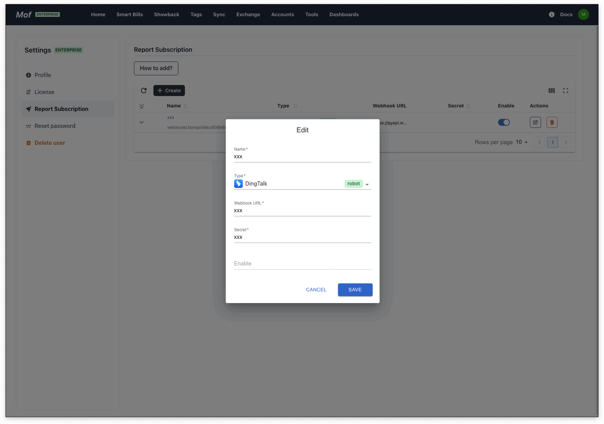
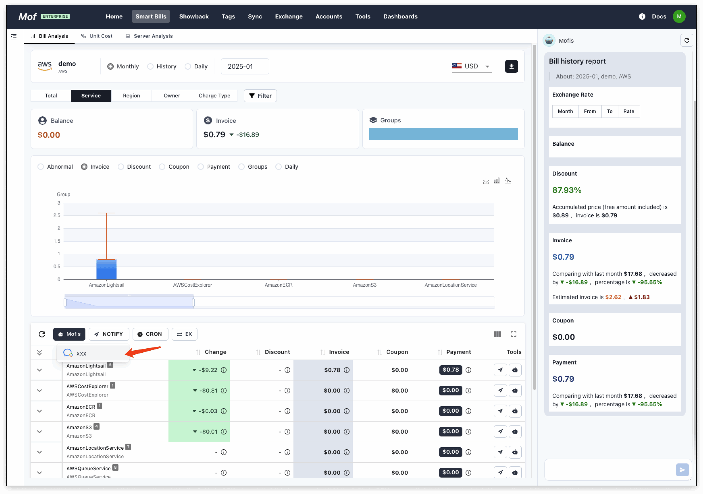
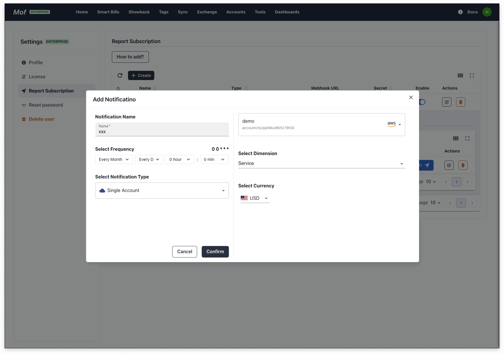

## Add group robot
### **1.Create group robot**

### **2.Select Webhook**

### **3.Set credential**

### **4.Copy webhook & cred**

### **3.Add**
**User** -> **Setting** -> **Report subscription**

## Send message

## Scheduled
Select the scheduled push type, time, exchange rate and other information.

