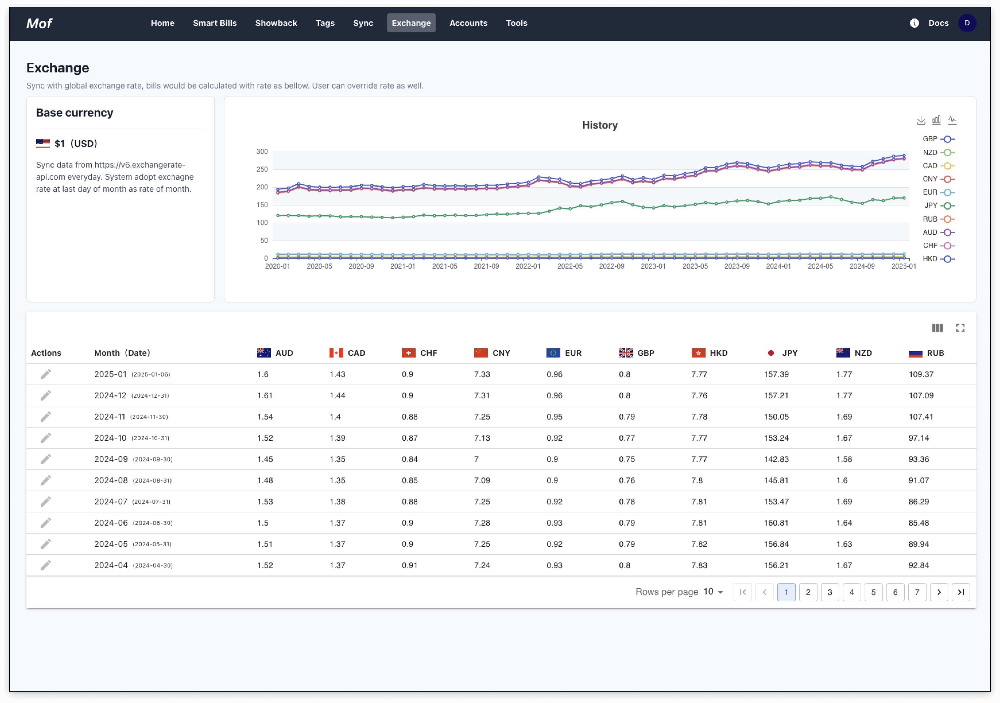
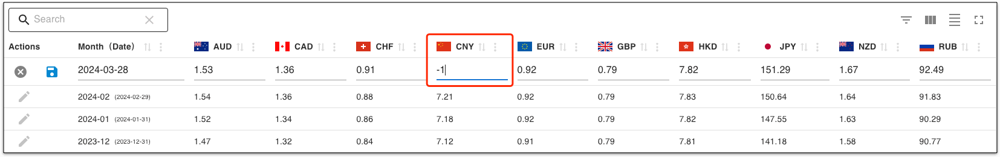

In a multi-cloud environment, you will encounter currency settlement issues. The system provides a set of real-time exchange rate services. The bill will be automatically settled into the settlement currency set by the user based on the **real-time exchange rate**.

To view the exchange rate, please click **Exchange**. The system uses **US dollars** as the base currency by default.

## Real time exchange
The system updates the current real-time exchange rate and historical exchange rate every day. Mof uses the exchange rate on the last day of the month by default.

## Override
### 1.Click edit button

### 2.Fill your exchange rate

### 3.Check sys rate & overridden rate
The overriding rate is highlighted, along with the system rate.

## Revert
To restore the exchange rate, just enter **-1** in the corresponding exchange rate box.

## Select currency

