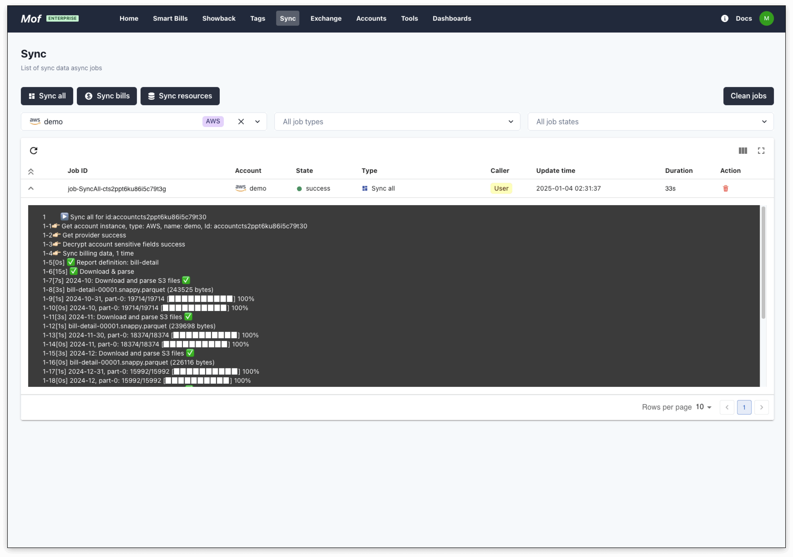

The system currently supports 10+ popular cloud vendors at home and abroad, and new cloud vendors will be added in the future, including IAAS, PAAS, and SAAS. 
You can contact us to add the cloud vendor you need.

## Select Cloud Provider
Move to **Accounts** -> **Add Cloud Account** -> **Select your cloud provider**

## Set Cloud Account Policy
Please follow **Guide** to complete policy assignment. **Policy table** listed all permissions required by system.

## Fill Cloud Account Info
Please fill required fields based on your selection.

!!! info "Basic"
    - **Basic Info**：Name and description only for representation, can be updated later.
    - **Region**：If currency are unknown for cloud account, currency will be determined based on region. Global(USD), China(CNY)
    - **Default group by**：The system collects data from all dimensions. The default dimension is used to count the costs of all cloud vendors, which does not affect the accuracy of the data.

## Start Sync Data
As soon as the cloud account is successfully added, the system will automatically start collecting data, which can be viewed in **Data Synchronization**.

The system synchronizes data from the previous **3 months** by default, and users can synchronize data from other time periods by themselves.

