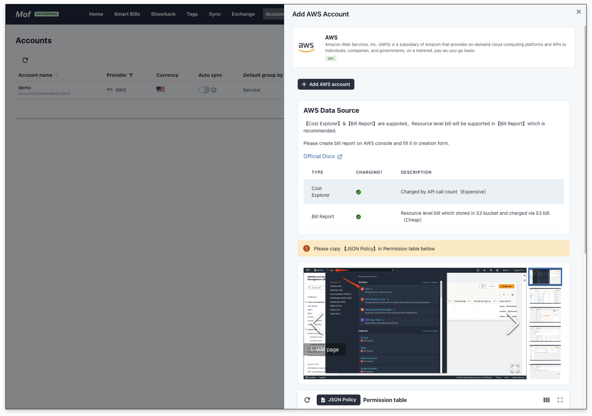
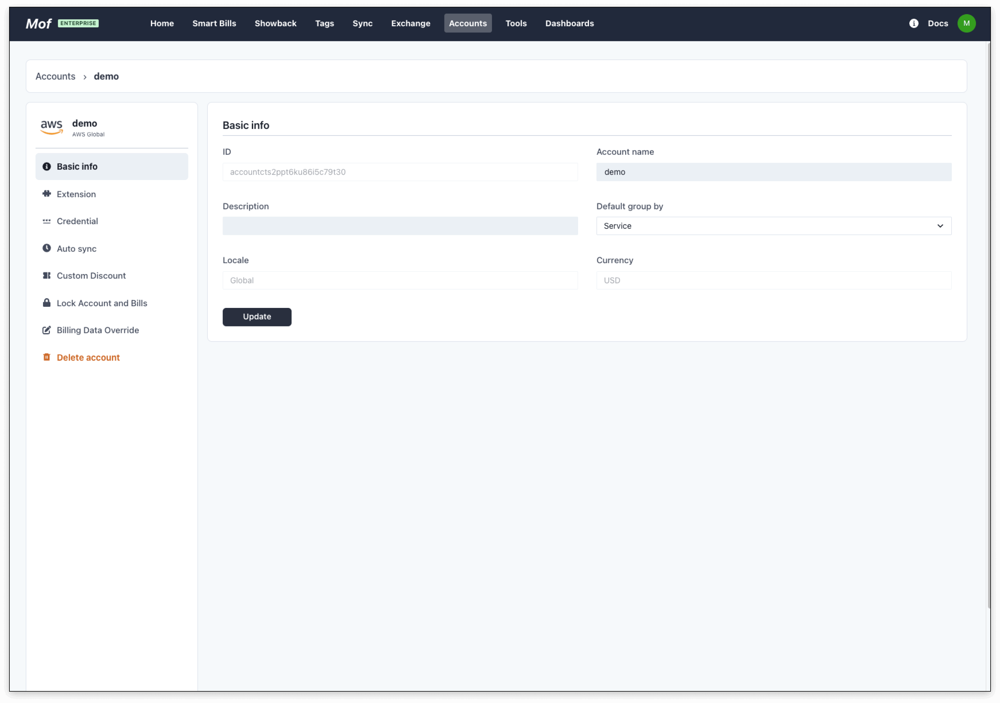
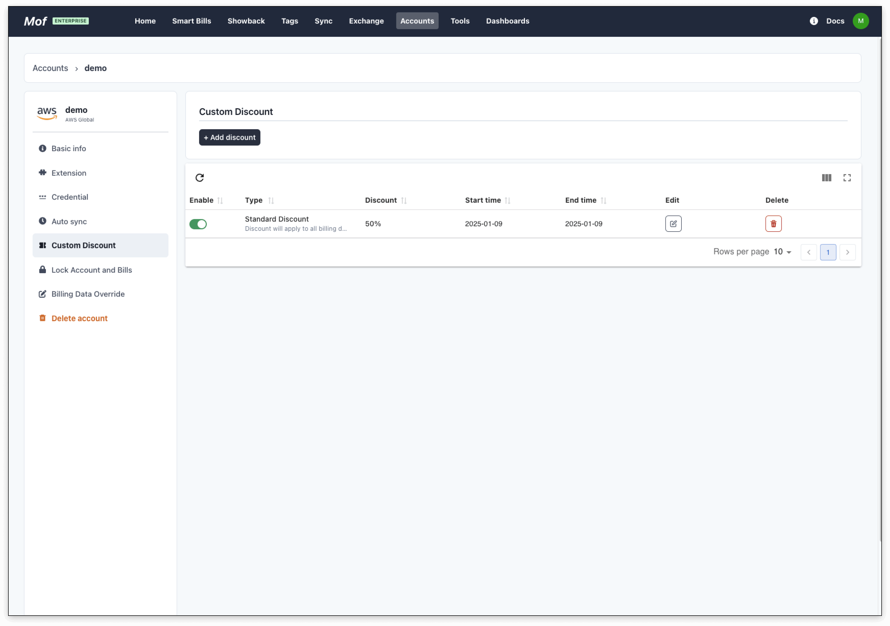
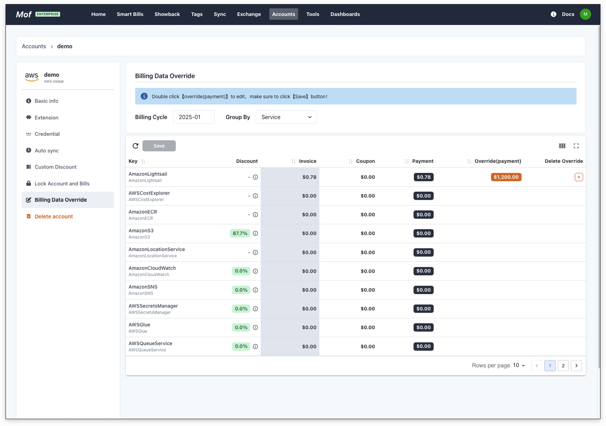
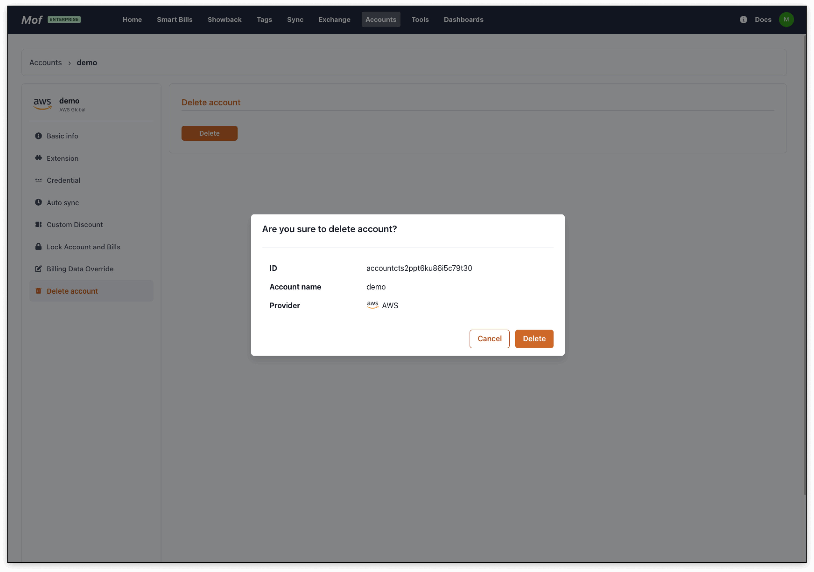

## Add cloud account

### **Permission**
The system's permissions may need to be supplemented as features are expanded. 
Users can select the corresponding cloud provider in the **console** to view the permissions currently required.

### **1.Basic info**
The account name is used for display purposes and can be duplicated. It is recommended to use unique names. **Can be modified.**

### **2.Region**
Please select the corresponding region based on the account ownership. **Can be modified.**

- [x] China
- [x] Region

### **3.Group by**
The system collects data from all dimensions. The default dimension is used to aggregate costs for all cloud providers and does not affect data accuracy.

---

## Edit account
### **1.Basic info**
**Can be modified.**

### **2.Credential**
**Cannot be modified.**

### **3.Scheduled data synchronization**
If enabled, the system will automatically synchronize data according to the configuration.
**Professional Edition** subscription is required.

### **4.Custom discount**
If the user has an offline discount contract that is not displayed in the billing data, they can configure it here. 
The discount will affect the data in **Smart Bill**.

### **5.Locking Cloud Accounts and Billing**
To prevent duplicate billing data retrieval, where changes such as tags might cause past billing data to be updated, two locks have been introduced.

- **Account Lock**：No new data will be fetched
- **Bill Lock**： The billing for the specified month will not be updated

### **6.Data Override**
Used to override the payment value for a specific month and a specific group.

### **7.Delete Cloud Account**
When a cloud account is deleted, all cost and resource data will be deleted.

