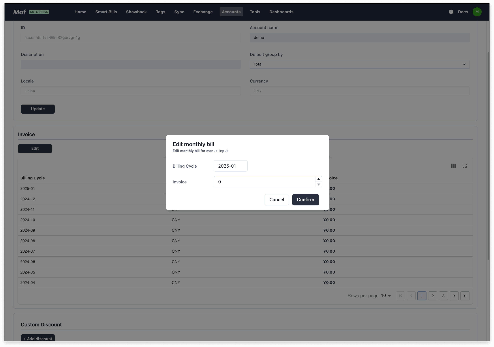

When the user is using a cloud provider that is not supported by the system, they can manually input the monthly billing data.

The billing data can be edited in the cloud account page after successful creation.

## Add account
### **Basic info**
Please refer to [Basic](basic.md)

### **Region**
Please select the corresponding region according to the account. **Editable**

- [x] China（CNY）
- [x] Global（USD）

## Update account
Please refer to [Basic](basic.md)

## Edit bill data
Edit bill data monthly.

