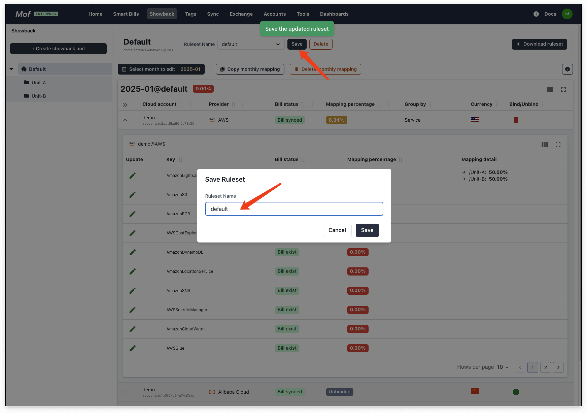

In a multi-cloud environment, cost allocation has always been a problem. Users can use the **Cost Allocation** function to easily allocate cloud account costs to custom collections.

## 1.Create units
A unit is a structure similar to a file system. Users can create tree-like units and then allocate cloud account bills to the units.

Units can have the same name, but this is not recommended.

## 2.Select month
The allocation rules are different every month because the allocation ratios of shared resource types (such as K8s) will be different.

## 3.Bind cloud account
Select the cloud account and select the classification dimension. Users need to allocate different classifications to units.

## 4.Allocate
Select the groups under the cloud account and allocate it to the created unit.

## 5.Save ruleset
Be sure to save the allocation rules.

## 5.Check showback

