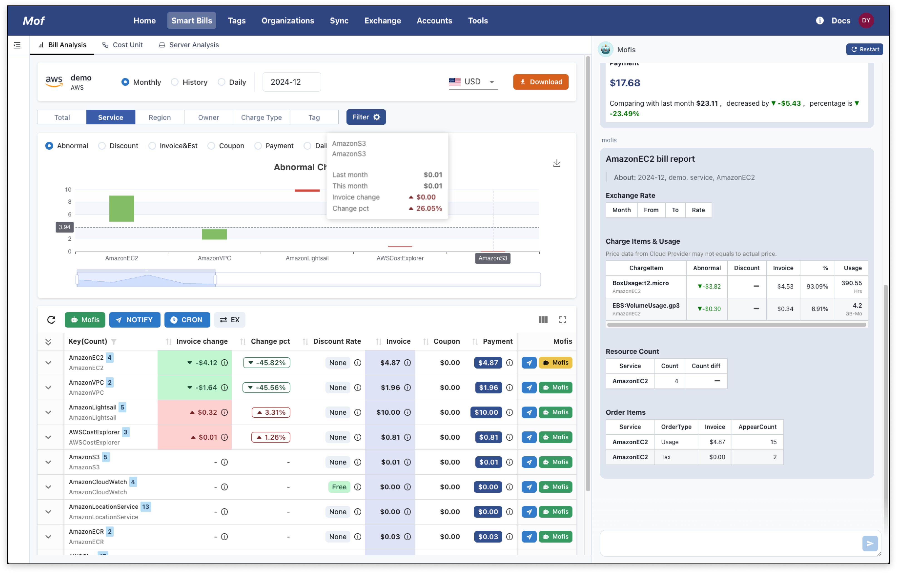
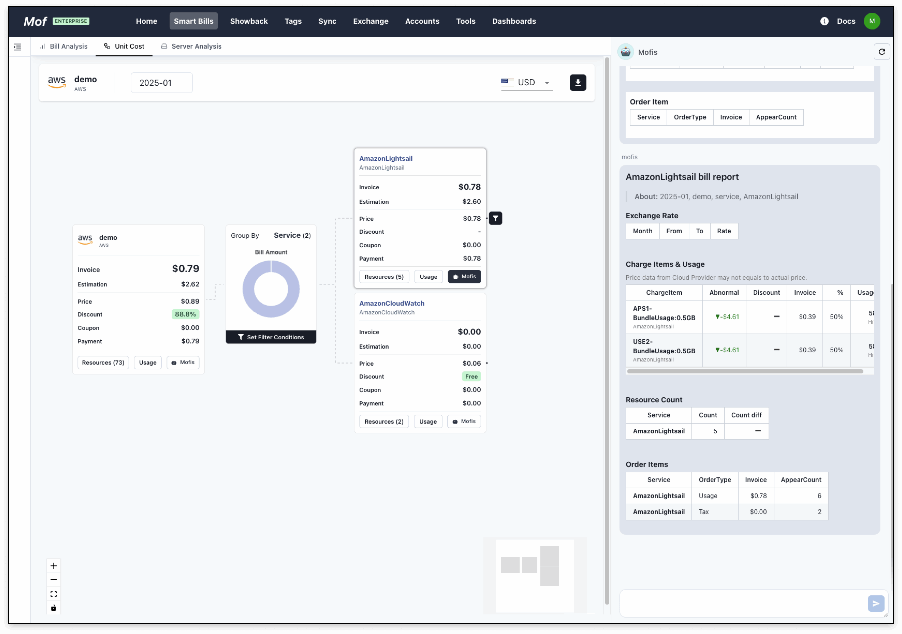
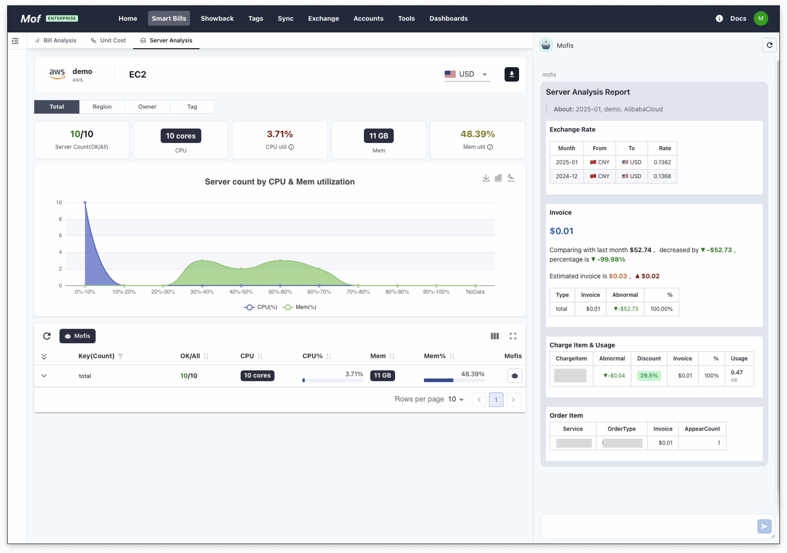

## Cost Explorer
Users can view billing data of different dimensions on a unified page and can also customize the data using filters.

### **Granularity**
- Monthly
- History
- Daily

### **Data Types**
- Price
- Discount
- Invoice
- Coupon
- Payment

### **Bill abnormal**
View bill changes between this month and last month.

### **Filters**
Select various filter criteria, such as service, region, tag, etc.

### **Download**
Download your bill in Excel format.

### **Bill notification**
Push data to tools such as WeChat for Enterprise, DingTalk, and Lark Suit.

### **Mofis Report**
The system generates a billing report that summarizes the billing situation of a certain category within a time period.

### **Exchange**
Automatic exchange rate conversion.

### **Charge item & usage**
View billing items and usage data & changes.

## Unit Cost
Unit Cost Explorer enables quick monitoring of unit costs through an easy-to-use user interface.

## Server analysis 
View server status, costs, and optimization space.

