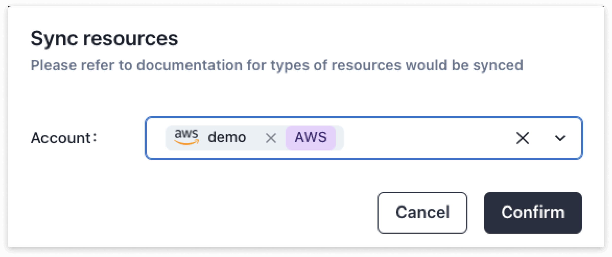

## Sync types

| Type          | Params              | Description                                                                   |
|---------------|---------------------|-------------------------------------------------------------------------------|
| Sync All      | N/A                 | Synchronize bills and resources of all cloud accounts (current month)         |
| Sync Bill     | Cloud account, time | Synchronize the bill of a cloud account, the time period selected by the user |
| Sync Resource | Cloud account       | Synchronize resources of a cloud account (current month)                      |

## Auto Sync
If the user needs to enable automatic synchronization, please go to **Cloud Account** -> **Scheduled Data Synchronization** settings.

When automatic synchronization is enabled, it is the same as the **Sync All Data** function.

## Manual Sync
### **Sync All**
Synchronize bills, resources, and optimization plans. Synchronize the current month's bills, resources, and optimization plans for the current month.

### **Sync Bill**
Synchronize the bills of the selected cloud account. The user can define the time period. When creating an account, the system will synchronize the data of the previous 3 months by default. Users can use this function to synchronize bills for longer periods of time.

### **Sync Resource**
Sync resources from cloud provider.

