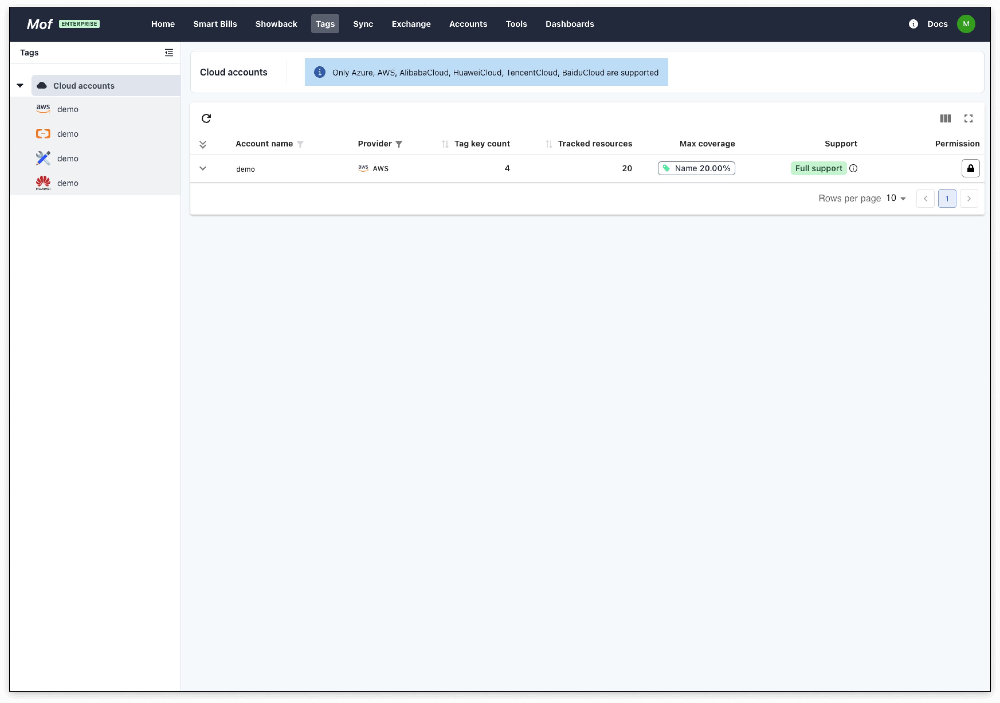
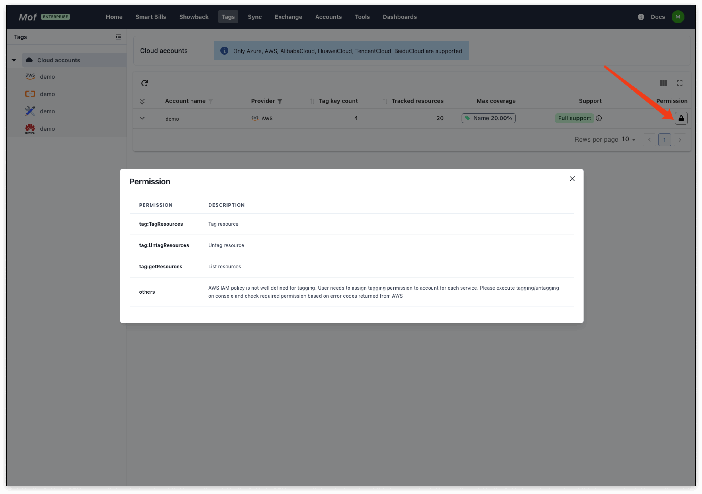
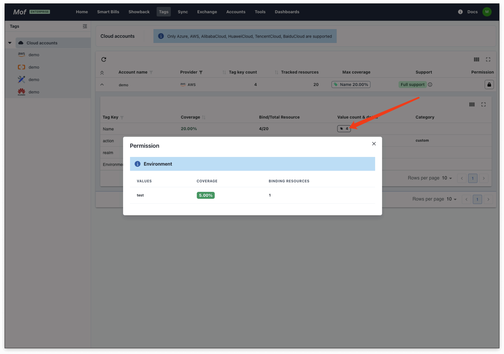
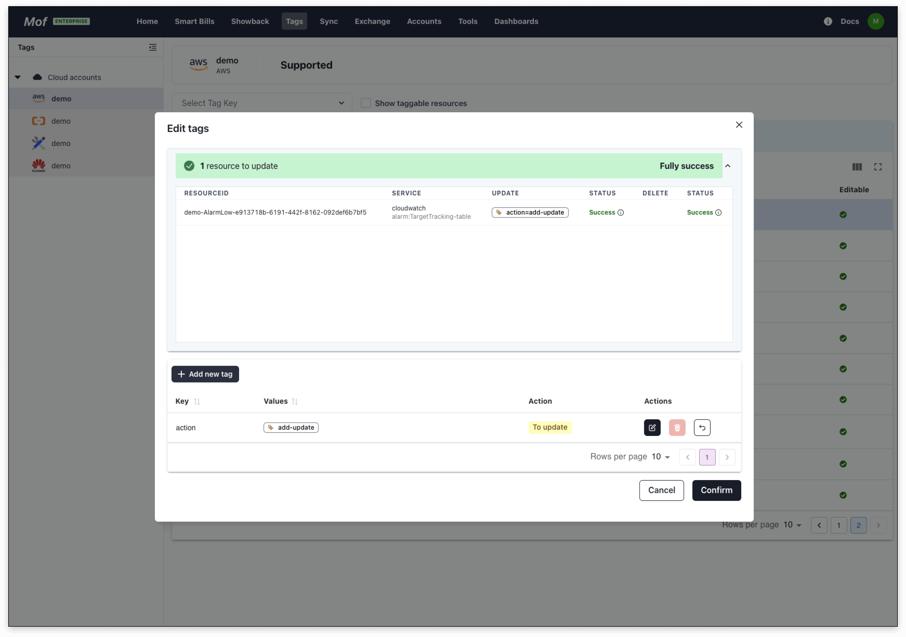
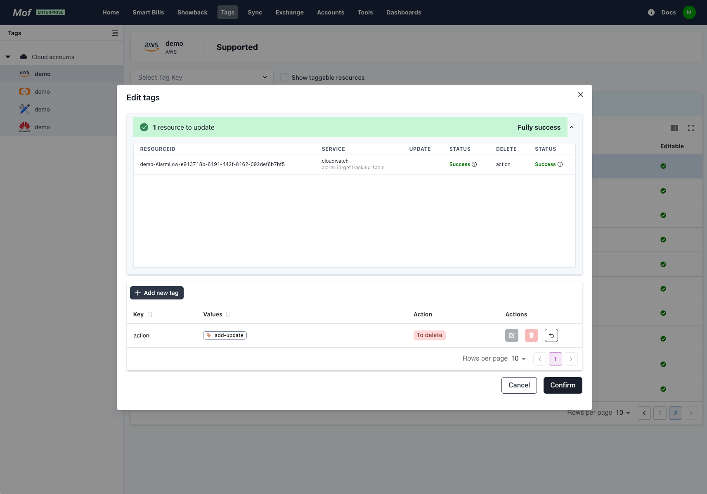

## Tag management

## List
### 1.Basic Info
Number of tags, coverage, and number of resources.

### 2.Permissions
Editing tags requires specific permissions of the cloud account.

!!! tip "Attention"
    Some cloud vendors require you to grant tag write permissions to different cloud services.

### 3.Coverage
Users can view the detailed coverage of Tag Key

## Edit
Unified **Edit** page.

### 1.Add Tag

**Success**
    

    
**Failure**

If it fails, you can check the error message to see if it is because of lack of authorization!
    

### 2.Edit Tag

### 3.Delete Tag
