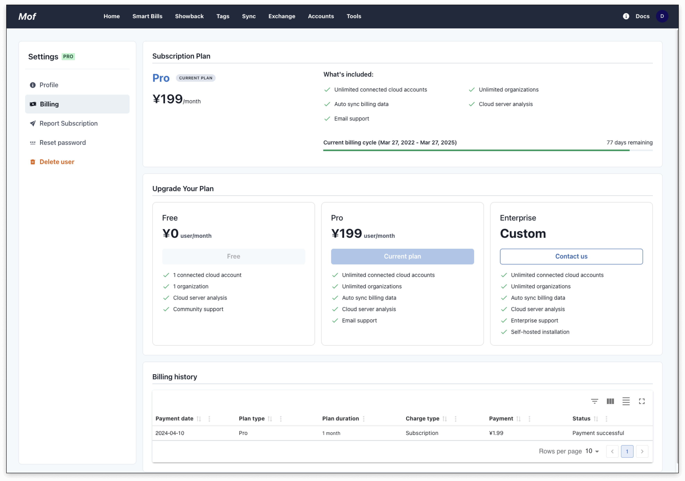
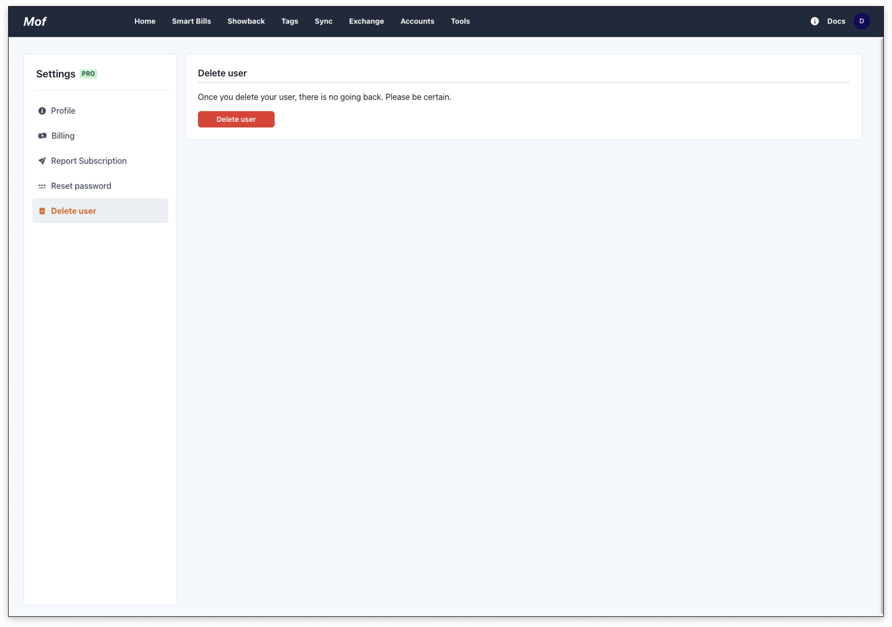

## Basic Info
- User name
- Default currency
- Lang

## Subscription

## Report Subscription
Add message subscription webhook and scheduled push.

### Report webhook
Supports **Enterprise WeChat group robots**, **DingTalk group robots**, **Lart Suit group robots**. For security reasons, the system supports the signature algorithm of group robots.

### Scheduled push
Users can push the following data to group robots at regular intervals.

- All cloud accounts (for the day, the month)
- Single cloud account (for the day, the month)
- Organizational structure (for the day, the month)

## Update password
If the user remembers the existing password, they can modify it directly. If the user does not remember the existing password, they can reset the password via email.

## Delete User
Once an account is cancelled, the system will immediately delete all user-related data. Including the following:

- Billing data
- Resource-related data
- Account-related data
- Message subscription-related data

